### 数据来源
kaggle的公开数据：[https://www.kaggle.com/datasnaek/youtube-new](https://www.kaggle.com/datasnaek/youtube-new)

该数据集包含有关YouTube每日热门视频的数据。包括美国，GB，DE，CA和FR等地区（分别为美国，英国，德国，加拿大和法国）的数据，每天最多列出200个趋势视频。

数据中category_id字段，在相关的json文件中。该文章分析的是美国地区的YouTube的热门视频。

**如果我们发布一个视频，如何让更多的人看到视频呢？主要考虑以下方面：**

账号

- 视频定位
    - 视频分类，主要定位
- 视频内容
    - 创作
        - 选题
        - 创意
        - 拍摄
        - 剪辑
    - 发布
        - 视频标题
        - 视频标签
        - 视频封面
        - 视频时长
        - 是否转载
        - 是否评论
- 运营
    - 视频发布时间
    - 粉丝管理
    - 观看、喜欢、不喜欢、评论、转载

**仔细观察了数据中的字段，发现可以从这几个角度去分析数据。**

**视频定位**

不同类型电影的统计量？

不同类型电影的播放量？（不同类型电影的热度如何？）

不同类型电影的上榜数量？

**运营**

发布时间是如何分布的？

从发布到上榜的时间差？不同类型之间有区别吗？

喜欢，不喜欢，评论，甚至关评论等等之间与观看有没有什么关系？

不同类别之间，喜欢，不喜欢，评论和观看是怎么样的？

### 数据处理
缺失值  data.info()  data.isnull().sum()
重复值  data.duplicates()   data.drop_duplicates()
异常值  data.describe()  直方图  箱型图
时间格式处理
分类字段处理

### 数据分析

**视频分类数据统计**

不同类型视频统计量

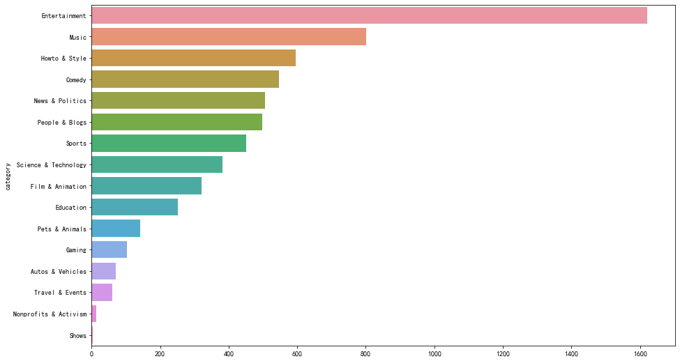

**分析：**

娱乐，音乐类型包含的视频量较高，动物类、游戏类、旅游和故事类、表演类包含的视频量相对较低

**不同类别视频的最大播放量，并找出此视频id以及播放量**

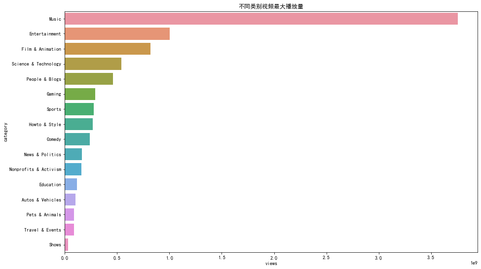

**分析：**

音乐类播放量最高的视频的播放量远高于其他类，其次是娱乐和电影两个类别

宠物类，旅游类和表演类的视频播放量较低

**不同类别视频的播放总量**

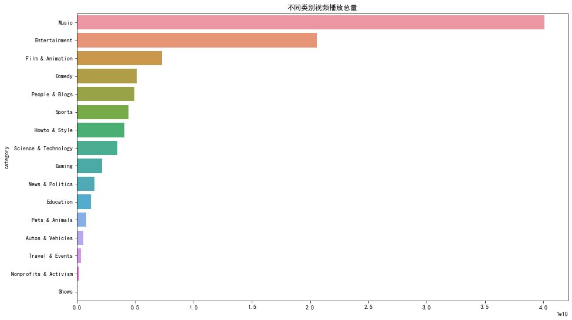

**不同类别视频的平均播放量**

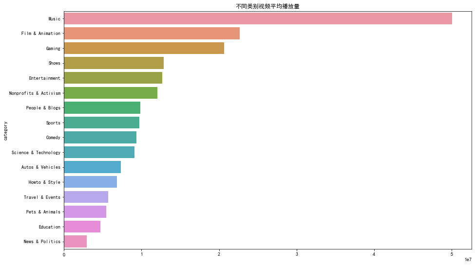

**分析：**

音乐，娱乐和电影类型的播放量，平均播放量都相对较高

游戏的播放量居于中间位置，但是平均播放量排第三

旅游，教育，动物，新闻类的视频无论是播放总量还是平均播放量都较低

**不同类别视频观看量箱型图比较**

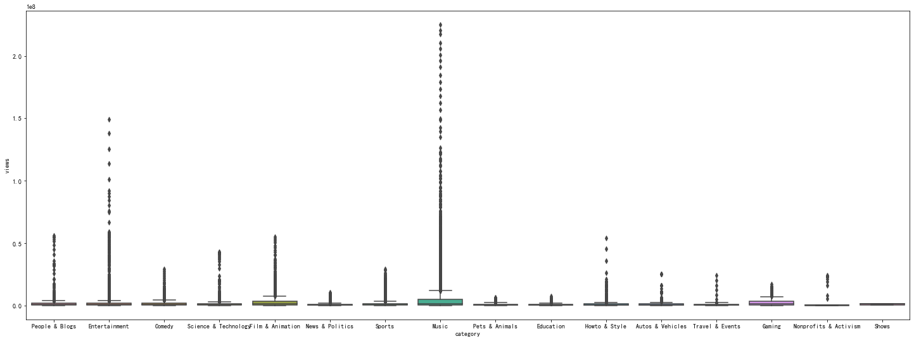

**什么类型的视频上榜次数最多**

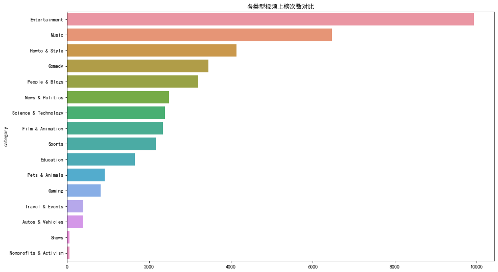

**分析：**

娱乐和音乐类型的视频上榜次数较多，电影类型视频上榜次数居中

**不同类型视频上榜次数箱型图比较**

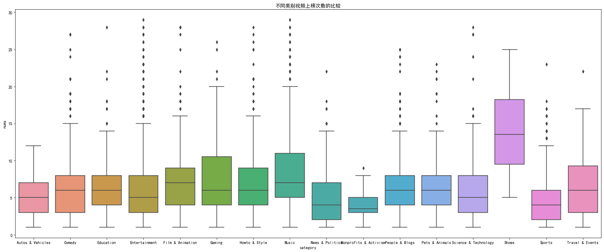

**分析：**

无论是总体来看还是分类别查看，绝大多数视频的上榜次数都集中在4-6次。

但同时也存在不少离群点，说明仍有一定数量的视频能反复十余次甚至二十余次上榜。

类别shows，结合前文来看，虽然只有4支视频登上trending榜单，但上榜的平均次数反倒是最多的。

### 分析

1.针对我们要拍什么类型的视频，视频定位

- 视频观看量前三的视频类型为音乐，娱乐，电影
- 音乐，电影和娱乐等类型播放量相对较高，播放率也相对较高，
- 娱乐、音乐类型的视频上榜次数也居前排

这三种类型的视频可以选择

**视频发布量随时间的变化趋势**

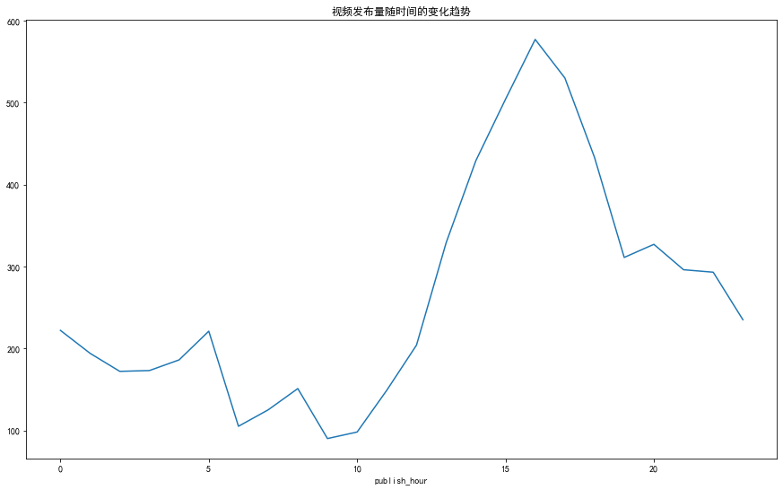

**分析：**

下午16点左右是发布时视频量最高的时间，可能因为过几个小时下班，刷youtube的人数较多，观看量也会相对较高，所以我们考虑在16-18点发布视频

**视频的发布时间与首次上榜时间之间的关系，视频发布与第一次上榜的时间差**

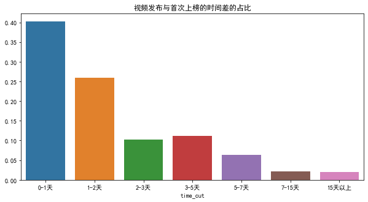

**分析：**

发布视频之后，有70%多的视频会在3天内上榜;但是也有一些视频隔很长时间甚至4215天才会上榜，突然上榜。

**不同类别视频首次上榜时间的比较**

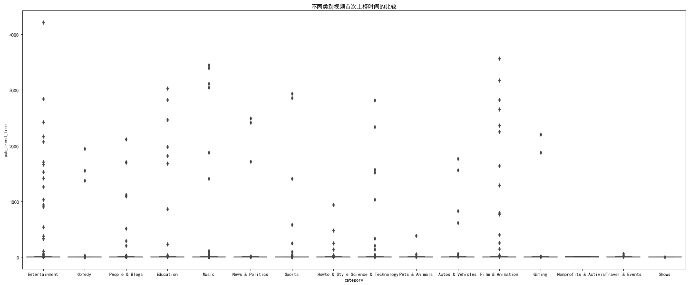

**分析：**

无论是总体来看还是分类别查看，绝大多数视频的上榜次数比较集中。

但同时也存在不少离群点，娱乐类视频最长的上榜时间竟然达到4000多天。

**视频的观看，喜欢，不喜欢，评论之间的转化，不同类别视频的转化率，不同视频的转化率**

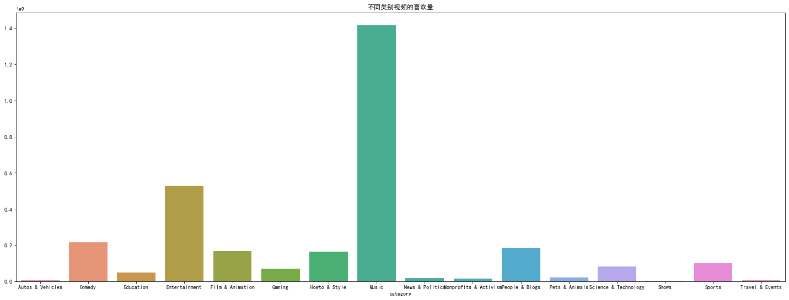

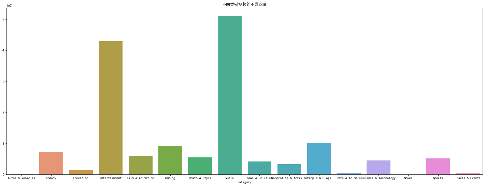

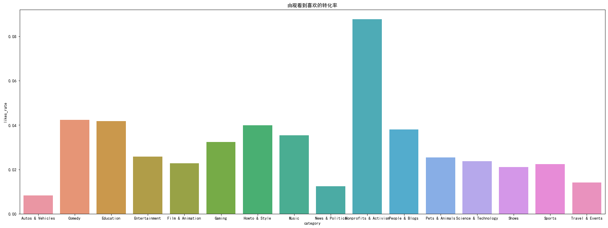

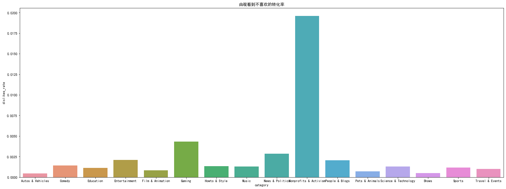

**分析：**

**观看、喜欢、不喜欢、评论之间的关系**

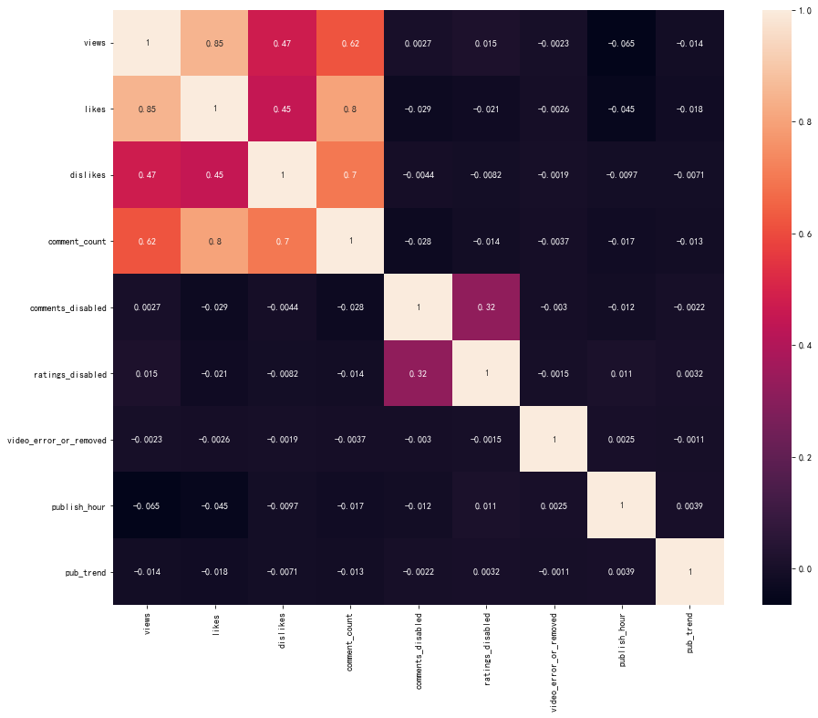

**分析：**

从图像上看，负数基本上都在-0.01左右，所以没有出现明显的负相关

颜色越浅表示有明显的正相关，观看和喜欢之间，喜欢和评论数之间有明显的正相关。

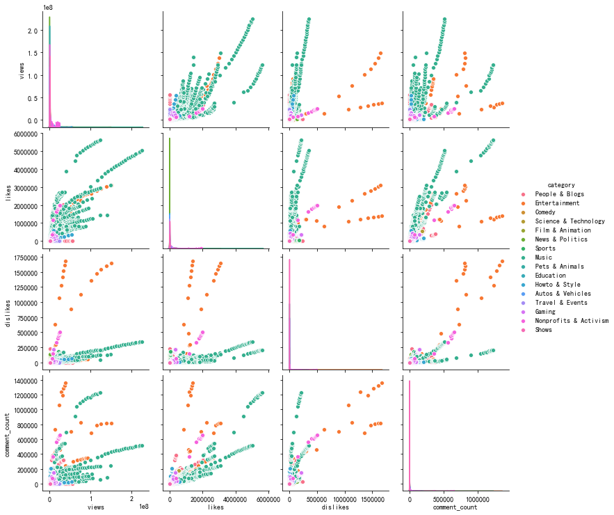

### 建议：

**视频定位**

- 可以从娱乐，音乐，以及film&animation 三个类型的视频去切入。

娱乐账号的上榜视频数量多，占总体上榜视频数的33%，有着非常广泛的受众，是一个很好的切入口。而音乐和film&animation的单个视频的观看量高，他们的平均观看是所有类别的2.54倍和1.29倍。一旦上榜，其播放量客观。

切勿轻易踏入人和博客这个领域。

这个领域分化比较严重，好的视频获赞不错，差的视频常常遭到用户的不喜欢。10000个观看中平均有3个dislike，是第二名的1.5倍。

电影是比较好的分类，有够强的专业实力可进入。

电影的每万人不喜欢率为最低，仅只有0.7个，且单个视频的观看量也非常之高，是所有类别的观看均值的2.48倍。虽然数据很优秀，口碑也非常好，但上榜视频仅仅只有6个，可见其上榜难度很大，够强的专业实力或许能帮你解决问题。

**运营**

- 视频发布时间可选择在下午15点至18点之间。

大多数YouTube博主在此时间段发视频，可能是考虑到往后发布过后的几个小时（5-8点左右）,是用户刷youtube的高峰期。

视频更新的间隔时间可以为3天。

有91.58%的youtube热门视频在3天之内上了热搜，如果3天内没上热推，那么后面上热推的概率就很小。可以以3天一个频率来发布视频。
